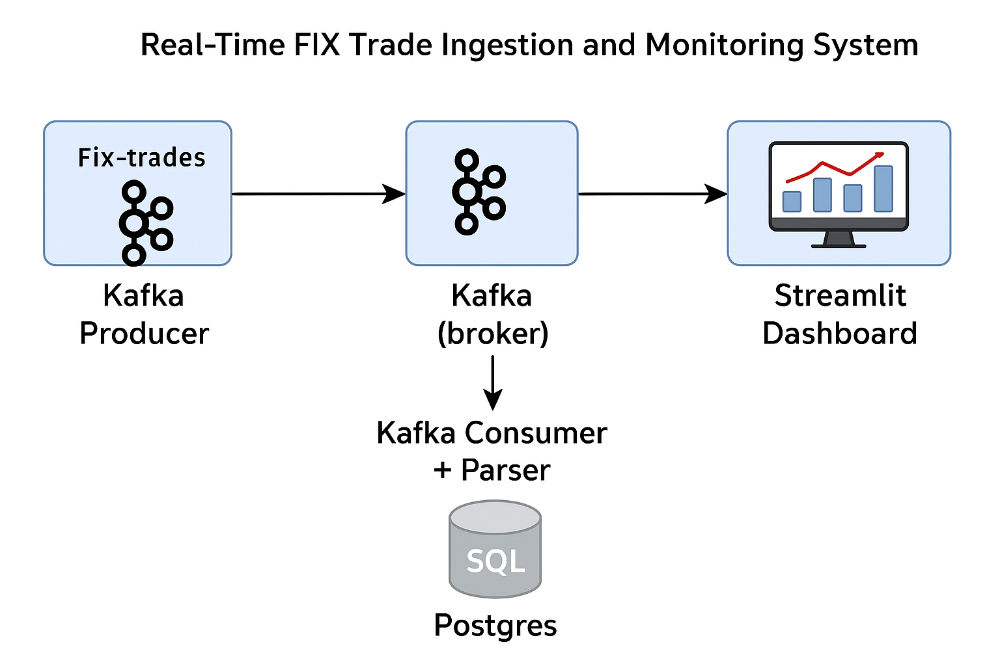
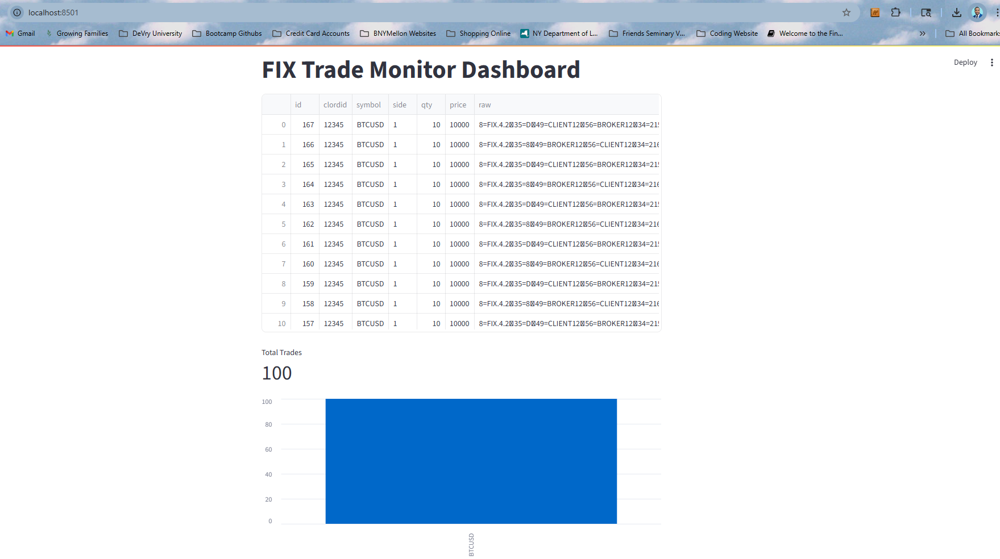

# Real-Time FIX Trade Ingestion & Monitoring System

---

## Overview

This project demonstrates a full, production-style trade monitoring system for financial markets.  
It ingests real-time [FIX protocol](https://en.wikipedia.org/wiki/Financial_Information_eXchange) trade messages via Kafka, parses, stores, and visualizes trades in a live dashboard.  
This workflow is a key part of modern FinTech and capital markets operations support.

---

## Features

- **Kafka Producer:** Simulates a live FIX order flow.
- **Kafka Consumer:** Parses FIX messages and stores trades in Postgres.
- **Custom FIX Parser:** Decodes and error-checks incoming messages.
- **Streamlit Dashboard:** Real-time trade monitoring and metrics.
- **Dockerized Stack:** Easy local deployment (Kafka, Zookeeper, Postgres).
- **Extensible:** Add alerting, REST endpoints, error handling as needed.

---

## Architecture

1. **Kafka Producer**  
   Generates and publishes simulated FIX protocol messages to the `fix-trades` Kafka topic.

2. **Kafka Consumer + Parser**  
   Consumes the messages, parses them for key trade data (order ID, symbol, qty, price, etc.), and stores them in a Postgres database.

3. **Streamlit Dashboard**  
   Connects to Postgres, displays the latest trades and real-time metrics/visualizations.

4. **(Optional) Alerts & API**  
   Can be extended to send alerts or expose trade search endpoints.

---

## Stack Diagram



---

## Quickstart

### 1. Clone & Install

```bash
git clone https://github.com/JUnelus/Real-Time-FIX-Trade-Ingestion-and-Monitoring-System.git
cd Real-Time-FIX-Trade-Ingestion-and-Monitoring-System
python -m venv venv
source venv/bin/activate   # Windows: .\venv\Scripts\activate
pip install -r requirements.txt
```

### 2. Launch Services

```bash
docker-compose up -d
```

### 3. Run the Kafka Producer

```bash
python producer/kafka_fix_producer.py
```

### 4. Run the Kafka Consumer/Parser

```bash
python -m consumer.kafka_fix_parser_consumer
```

### 5. Start the Dashboard

```bash
streamlit run dashboard/streamlit_app.py
```

Visit [http://localhost:8501](http://localhost:8501) to view the dashboard.

---

## Key Files

- `producer/kafka_fix_producer.py` – Simulates FIX message flow
- `consumer/kafka_fix_parser_consumer.py` – Consumes, parses, and stores trades
- `parser/fix_parser.py` – Core FIX parsing logic
- `dashboard/streamlit_app.py` – Real-time monitoring UI
- `docker-compose.yml` – Spins up Kafka, Zookeeper, and Postgres services

---

## Extending the Project

- Add Slack/email alerting for trade errors or stuck messages
- Support more FIX message types or real exchange integrations
- REST API for trade lookup, health checks, or re-ingestion

---

## Screenshot



---