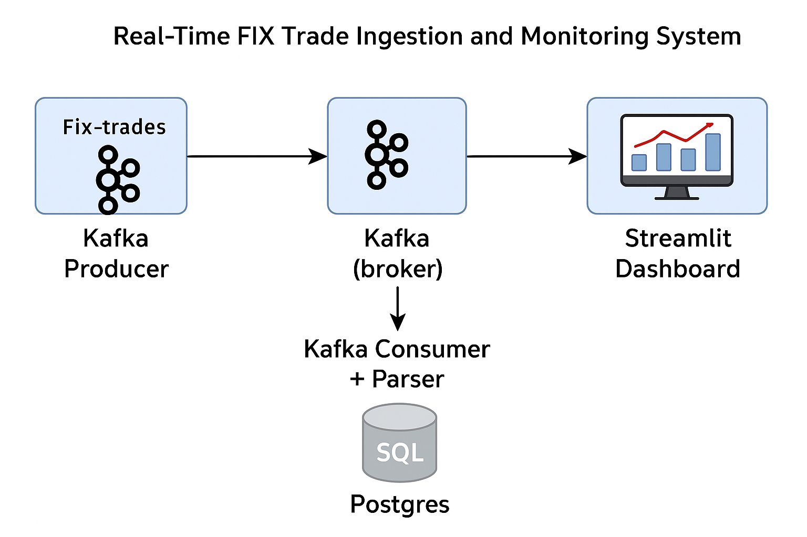

# Real-Time FIX Trade Ingestion & Monitoring System

---

## Overview

This project demonstrates a full, production-style trade monitoring system for financial markets.  
It ingests real-time [FIX protocol](https://en.wikipedia.org/wiki/Financial_Information_eXchange) trade messages via Kafka, parses, stores, and visualizes trades in a live dashboard.  
This workflow is a key part of modern FinTech and capital markets operations support.

---

## Features

- **Kafka Producer:** Simulates a live FIX order flow.
- **Kafka Consumer:** Parses FIX messages and stores trades in Postgres.
- **Custom FIX Parser:** Decodes and error-checks incoming messages.
- **Streamlit Dashboard:** Real-time trade monitoring and metrics.
- **Dockerized Stack:** Easy local deployment (Kafka, Zookeeper, Postgres).
- **Daily FIX Producer:** Automated GitHub Action that fetches top 5 cryptocurrencies and top 5 stocks daily, converts to FIX messages.
- **Automated Dashboard Updates:** Daily GitHub Action to update dashboard screenshots with fresh data.
- **Extensible:** Add alerting, REST endpoints, error handling as needed.

---

## Architecture

1. **Kafka Producer**  
   Generates and publishes simulated FIX protocol messages to the `fix-trades` Kafka topic.

2. **Kafka Consumer + Parser**  
   Consumes the messages, parses them for key trade data (order ID, symbol, qty, price, etc.), and stores them in a Postgres database.

3. **Streamlit Dashboard**  
   Connects to Postgres, displays the latest trades and real-time metrics/visualizations.

4. **(Optional) Alerts & API**  
   Can be extended to send alerts or expose trade search endpoints.

---

## Stack Diagram



---

## Quickstart

### 1. Clone & Install

```bash
git clone https://github.com/JUnelus/Real-Time-FIX-Trade-Ingestion-and-Monitoring-System.git
cd Real-Time-FIX-Trade-Ingestion-and-Monitoring-System
python -m venv venv
source venv/bin/activate   # Windows: .\venv\Scripts\activate
pip install -r requirements.txt
```

### 2. Launch Services

```bash
docker-compose up -d
```

### 3. Run the Kafka Producer

```bash
python producer/kafka_fix_producer.py
```

### 4. Run the Kafka Consumer/Parser

```bash
python -m consumer.kafka_fix_parser_consumer
```

### 5. Start the Dashboard

```bash
streamlit run dashboard/streamlit_app.py
```

Visit [http://localhost:8501](http://localhost:8501) to view the dashboard.

---

## Key Files

- `producer/kafka_fix_producer.py` – Simulates FIX message flow
- `producer/top_crypto_stocks_to_fix.py` – **NEW** Fetches top 5 crypto/stocks and generates FIX messages (used by GitHub Actions)
- `consumer/kafka_fix_parser_consumer.py` – Consumes, parses, and stores trades
- `parser/fix_parser.py` – Core FIX parsing logic
- `dashboard/streamlit_app.py` – Real-time monitoring UI
- `docker-compose.yml` – Spins up Kafka, Zookeeper, and Postgres services
- `.github/workflows/daily_fix_producer.yml` – **NEW** Primary workflow: validates on push, runs daily, produces FIX data, updates dashboard screenshot, and commits artifacts
- `.github/workflows/update_dashboard_screenshot.yml` – **NEW** On-demand screenshot refresh workflow for manual recovery/regeneration

---

## Extending the Project

- Add Slack/email alerting for trade errors or stuck messages
- Support more FIX message types or real exchange integrations
- REST API for trade lookup, health checks, or re-ingestion
- Configure GitHub Actions secrets for external Kafka servers
- Integrate with additional data sources (Alpha Vantage, IEX Cloud)
- Add data persistence for historical analysis
- Implement ML-based anomaly detection

---

## GitHub Actions Monitoring

### View Workflow Status

1. Navigate to your GitHub repository
2. Click the **Actions** tab
3. Select the workflow:
   - **Daily FIX Producer** – Check push validation, daily execution, and dashboard/report updates
   - **On-Demand Dashboard Screenshot Refresh** – Manually regenerate the dashboard screenshot if needed

### Manual Trigger

To run workflows immediately (instead of waiting for a schedule):

```bash
# Via GitHub CLI
gh workflow run daily_fix_producer.yml
gh workflow run update_dashboard_screenshot.yml
```

Or use GitHub UI: Actions → Select Workflow → Run Workflow

### Artifacts

- **Daily FIX Messages:** Available in workflow run artifacts
  - File: `daily_fix_messages.json`
  - Retention: 30 days
  - Download from: Actions → Workflow Run → Artifacts

### Dashboard Screenshot Archive

- Location: `docs/daily_reports/`
- Naming: `fix_messages_YYYY-MM-DD.json`
- Auto-committed daily

---

## Setup Instructions Summary

### Prerequisites
- Python 3.8+
- Docker & Docker Compose
- Git (for GitHub Actions)

### Local Development
1. Clone repository
2. Create virtual environment: `python -m venv venv`
3. Activate: Windows: `.\venv\Scripts\activate` | Linux/Mac: `source venv/bin/activate`
4. Install dependencies: `pip install -r requirements.txt`

### Local Docker Services
```bash
# Start services
docker-compose up -d

# Create .env file
echo "POSTGRES_DB=fixdb" > .env
echo "POSTGRES_USER=fixuser" >> .env
echo "POSTGRES_PASSWORD=fixpass" >> .env
```

### Local Execution (3-terminal setup)
```bash
# Terminal 1: Kafka Producer
python producer/kafka_fix_producer.py

# Terminal 2: Kafka Consumer/Parser
python -m consumer.kafka_fix_parser_consumer

# Terminal 3: Dashboard
streamlit run dashboard/streamlit_app.py
```

### Daily Automated Execution (GitHub Actions)
- No setup needed if you push to GitHub
- Actions run automatically on schedule
- Check the Actions tab for status
- Download artifacts from workflow runs

---

## Daily FIX Producer (Automated via GitHub Actions)

### Overview

The system now includes an automated primary workflow plus an on-demand recovery workflow:

1. **Daily FIX Producer Action** – Runs on every push, manual dispatch, and daily at 9:00 AM UTC
   - Fetches top 5 cryptocurrencies by market cap from CoinGecko API
   - Fetches top 5 stocks by market cap using yfinance
   - Converts all data to FIX ExecutionReport messages (MsgType=8)
   - Saves the real FIX output to `daily_fix_messages.json`
   - Uploads that file as a workflow artifact
   - Loads that same artifact into Postgres for the dashboard screenshot job
   - Commits the daily JSON report and updated screenshot back to the repository

2. **On-Demand Dashboard Screenshot Refresh** – Runs manually via `workflow_dispatch`
   - Regenerates the latest FIX messages locally
   - Loads those messages into Postgres using the same helper scripts as the primary workflow
   - Runs Streamlit dashboard and captures a fresh screenshot
   - Commits the updated screenshot when needed

### How the Daily Producer Works

#### Step 1: Data Fetching

**Cryptocurrencies:**
- Uses CoinGecko API (free, no auth required)
- Fetches top 5 by market cap
- Includes: symbol, name, current price, market cap

**Stocks:**
- Uses yfinance library
- Fetches historical data for popular large-cap stocks
- Top 5: AAPL, MSFT, GOOGL, AMZN, NVDA
- Includes: symbol, name, current price, market cap

#### Step 2: FIX Message Generation

Each security (crypto or stock) is converted to a FIX ExecutionReport (35=8) message:

```
8=FIX.4.2|35=8|49=DAILY-PRODUCER|56=TRADE-SYSTEM|34=1000|52=20260512-090000|11=1000|55=BTC-USD|54=1|38=0.1|44=45000.0|...
```

Fields included:
- `8` - BeginString (FIX version)
- `35` - MsgType (ExecutionReport)
- `49` - SenderCompID (DAILY-PRODUCER)
- `55` - Symbol (e.g., BTC-USD, AAPL)
- `54` - Side (1=Buy)
- `38` - Quantity (0.1 for crypto, 100 for stocks)
- `44` - Price (current market price)
- `52` - SendingTime (UTC timestamp)

#### Step 3: Message Distribution

- **Primary:** Sends to Kafka `fix-trades` topic (if available)
- **Backup:** Saves to `daily_fix_messages.json` with timestamp
- **Archive:** Stores daily reports in GitHub Actions artifacts

### Running the Daily Producer Locally

```bash
# Install dependencies
pip install -r requirements.txt

# Run the producer
python producer/top_crypto_stocks_to_fix.py
```

This generates a `daily_fix_messages.json` file with all FIX messages.

### GitHub Actions Workflows

#### File: `.github/workflows/daily_fix_producer.yml`

**Trigger:** On every push, daily at 9:00 AM UTC, or manual via `workflow_dispatch`

**Steps:**
1. Check out code
2. Set up Python 3.11
3. Install requirements
4. Run top_crypto_stocks_to_fix.py producer
5. Upload artifacts (daily_fix_messages.json)
6. Generate the summary report
7. Start a second job that downloads the artifact
8. Load the artifact into Postgres
9. Capture the dashboard screenshot from the real producer output
10. Commit the daily report JSON and screenshot

**Artifacts:** Available for 30 days

#### File: `.github/workflows/update_dashboard_screenshot.yml`

**Trigger:** Manual via `workflow_dispatch`

**Services:**
- PostgreSQL 13 (auto-initialized)

**Steps:**
1. Check out code
2. Set up Python 3.11
3. Install dependencies + Playwright
4. Generate `daily_fix_messages.json`
5. Initialize a database with schema
6. Load the generated FIX messages into Postgres
7. Start Streamlit dashboard
8. Capture screenshot using Playwright
9. Replace dashboard/img.png
10. Commit and push changes

---

## Screenshot

**Updated Daily via GitHub Actions** 🤖

This screenshot is automatically captured at 9:30 AM UTC each day after the daily FIX producer fetches the latest top 5 cryptocurrencies and top 5 stocks. It displays the real-time trade monitoring dashboard with current market data.


**Last Updated:** Check the git commit history for the most recent update timestamp.

---